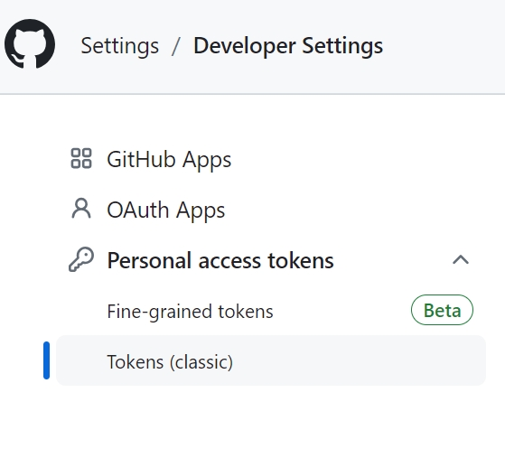

## Overview

This section will guide you through the process of connecting PyCharm to your GitHub account, enabling seamless interaction with GitHub repositories directly from the PyCharm IDE.

## Steps for Connecting GitHub with PyCharm

1. Go to github.com and log in to your account, then navigate to Personal Access Tokens by clicking on your profile picture in the top-right corner, selecting **Settings** from the dropdown menu, select **Developer Settings** in the left sidebar, click on **Personal access tokens**, and then click **Tokens(classic)**.

    

2. Click on the **Generate new token** button, select the scopes (permissions) needed for the token, and then click on **Generate token**.

    !!! warning "GitHub Token"
        Save your token now because it will be shown only once.

    !!! Danger "GitHub Token"
        Always store your GitHub token securely to prevent unauthorized access to your repositories.

3. Launch PyCharm on your computer.

4. Click the **File** menu, then click **Settings**.

5. In the Preferences window, locate the search bar in the top left corner, enter GitHub into the search bar.

    

6. Provide your GitHub token in the GitHub settings within PyCharm.

    

7. Check for your GitHub avatar in the list of accounts within PyCharm, this confirms that PyCharm is connected to your GitHub account.

    !!! success "Success"
        Now you have connected your GitHub account to PyCharm.

8. Click the **File** menu, then choose **New Project** from the drop-down menu. Click the **Get from VCS** button in the top right corner.

9. Enter the repository URL, choose directory, and then click **Clone**

    

10. Make changes to your project in PyCharm, push the changes to your GitHub repository.

11. Check the code in your GitHub repository and verify that the changes are updated.

## Conclusion

By the end of this section, you will have successfully learned the following:

:material-check: How to generate a GitHub token

:material-check: How to connect PyCharm to your GitHub account

:material-check: How to clone a repository from GitHub to your PyCharm

:material-check: How to push changes to your GitHub repo

Great job! 😊 You can now clone repositories, push changes, and interact with GitHub repositories with ease.
