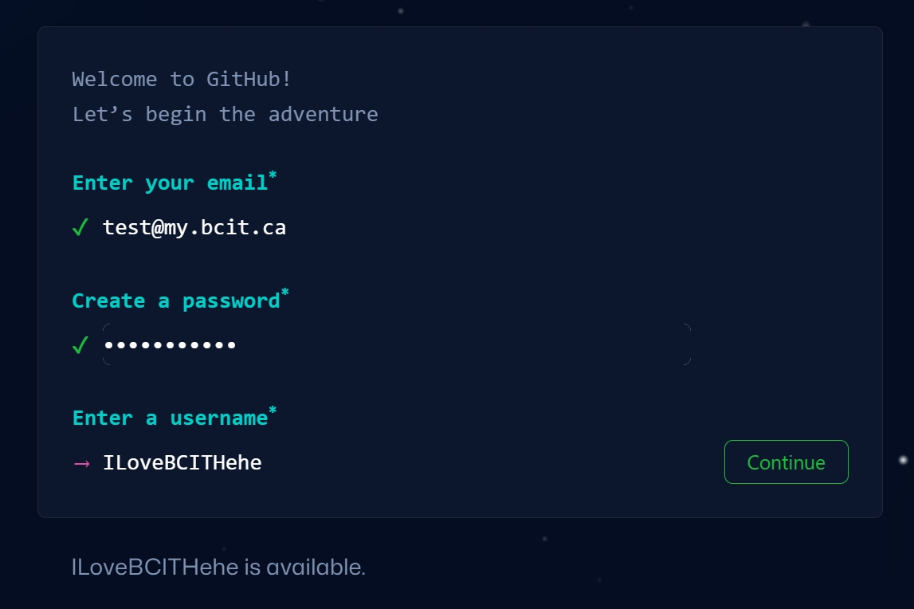
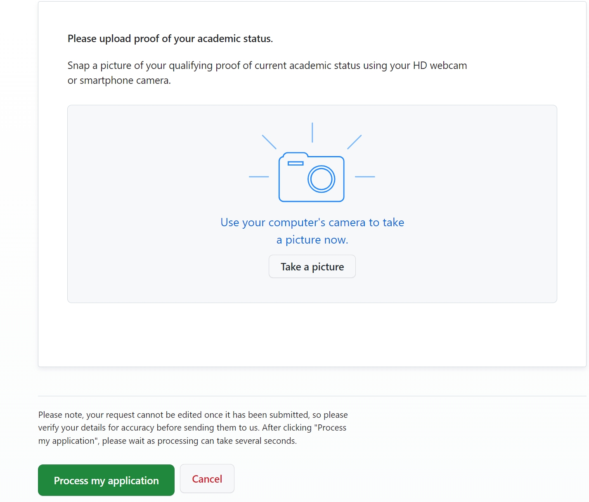

## Overview

This section will guide you through creating a GitHub account, which is necessary for connecting to PyCharm.

## Steps for Creating a GitHub account

1. Open your web browser and navigate to the GitHub website: [https://github.com/](https://github.com/).
    
2. Click on the **Sign Up** button in the top right corner.

    

    You will be directed to a sign-up page where you need to enter your information.

3.  Enter your email, password, and username, then click the **Continue** button to proceed.

    

    !!! info "Email"
        Use your BCIT email for a free student plan.
        
4. Select your Email preferences, then click **Continue** again.

    
    
5. Check your inbox for a verification email from GitHub, and click on the link provided to confirm your email address.
    
    You will be redirected back to the GitHub website.

6. Click the **Apply for your GitHub student benefits** button.
       
       

    You will be redirected to another page.

7. Click the **Sign up for Student Developer Pack** button, choose your academic status as Student.

    

8. **Take a picture** of your BCIT student card with your webcam, Click the **Process my application** button.

    

    This process might take a couple of minutes.

9. Read through GitHub's terms of service and if you agree, click on the checkbox to accept them.

10. Click on the **Create account** button.

    !!! success "Success"
        Now you have a new GitHub account.

## Conclusion

By the end of this section, you will have successfully learned the following:

:material-check: How to create a new GitHub account

:material-check: How to apply for GitHub student benefits

Great job! 😊 You can go ahead and click on the link below to move on to the next step:

**[Install PyCharm](pycharmInstallation.md)**