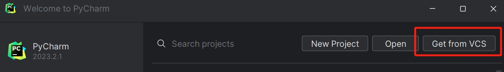

## Overview

This section will guide you through the process of connecting PyCharm to your GitHub account, enabling seamless interaction with GitHub repositories directly from the PyCharm IDE.

## Steps for Connecting GitHub with PyCharm

1. **Generate GitHub Personal Access Token:**
    - Open your GitHub account settings in a web browser.
    - Navigate to "Developer settings" > "Personal access tokens".
    - Click on "Generate new token" and provide a token description.
    - Click on "Generate token" and copy the generated token.

    !!! warning "GitHub Token"
        Save your token now because it will be shown only once.

2. **Open PyCharm:**
    - Launch PyCharm on your computer.

3. **Access PyCharm Preferences:**
    - Go to "Customize" > "All Settings" from the Welcome window.

4. **Search for GitHub Preferences:**
    - In the Preferences window, locate the search bar in the upper left-hand corner.
    - Enter "GitHub" into the search bar.

5. **Add GitHub Account Information:**
    - Provide your GitHub token in the GitHub settings within PyCharm.

6. **Verify Connection:**
     - After adding your GitHub account information, check for your GitHub avatar in the list of accounts within PyCharm.
     - This confirms that PyCharm is connected to your GitHub account.

7. **Create a new Project in PyCharm:**
    - Click the "File" menu.
    - Choose "New Project" from the drop-down menu.

8. **Clone Repository from GitHub:**
    - Click the "Get from VCS" button in the top right corner.
    - Select "Git" > "Clone Repository" and enter the repository URL.

    

9. **Push Changes to GitHub:**
    - Make changes to your project in PyCharm.
    - Use the VCS menu to push the changes to your GitHub repository.

10. **Verify Interaction:**
    - Check the code in your GitHub repository and verify that the changes are updated.

## Conclusion

By the end of this section, you will have successfully learned the following:

:material-check: How to generate a GitHub token

:material-check: How to connect PyCharm to your GitHub account

:material-check: How to clone repository from GitHub to your PyCharm

:material-check: How to push changes to your GitHub repo

Great job! 😊 You can now clone repositories, push changes, and interact with GitHub repositories with ease.
