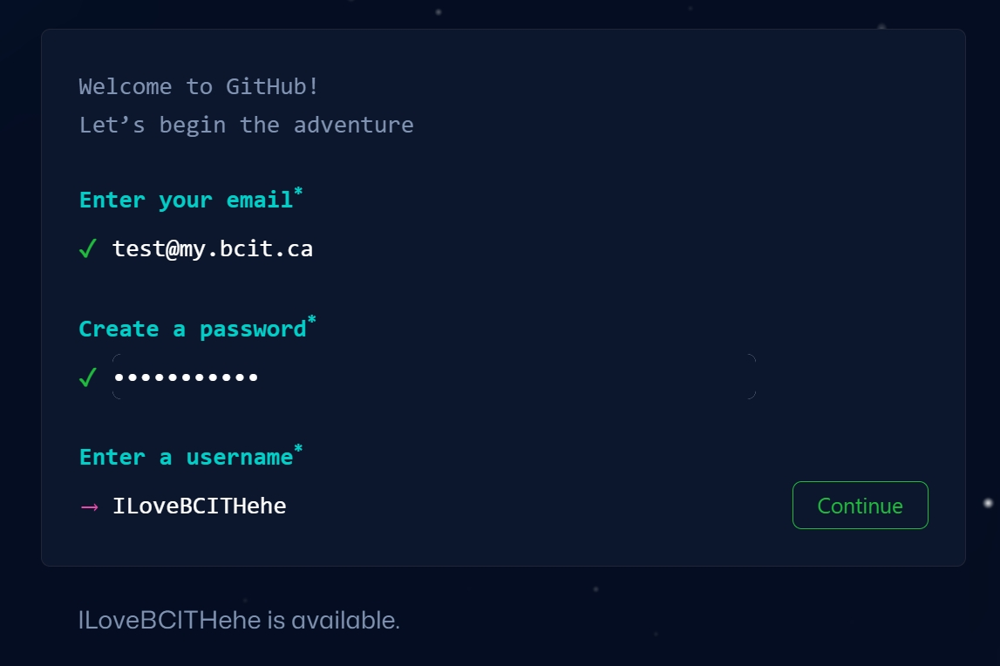

## Overview

This section will guide you through creating a GitHub account, which is necessary for connecting to PyCharm.

## Steps for creating a GitHub account

1. **Open GitHub Website:**
    - Open your web browser and navigate to the GitHub website: [https://github.com/](https://github.com/)
    
2. **Click "Sign Up":**
    - Click on the "Sign Up" button in the top right corner.

    

    - You will be directed to a sign-up page where you need to enter your information.

3. **Enter Information:**
    - Enter your email, password, and username, then click the Continue button to proceed.

    

    !!! info "Notes"
        - Use your BCIT email for a free student plan.
        - Remember your password.
        
4. **Select Email Preferences:**
    - Select your Email preferences, then click Continue again.

    
    
5. **Verify Email:**
    - Check your inbox for a verification email from GitHub, and click on the link provided to confirm your email address.
    - You will be redirected back to the GitHub website.

6. **Apply for Student Benefits:**
    - Scroll down to the page.
    - Click "Apply for your GitHub student benefits" button.
    - You will be redirected to another page.

    

7. **Sign up for Student Developer Pack**
- Click "Sign up for Student Developer Pack" button.
- Choose your academic status as "Student".

    

8. **Upload Proof of Your Academic Status**
- Take a picture of your BCIT student card with your webcam.
- Click "Process my application" button.
- This process might take a couple of minutes.

    

9. **Accept Terms of Service:**
    - Read through GitHub's terms of service and if you agree, click on the checkbox to accept them.

10. **Create Account:**
    - Click on the "Create account" button.
    - Now you have a new GitHub account

## Conclusion
By the end of this section, you will have successfully learned the following:

✅How to apply for GitHub student benefits

✅How to create a new GitHub account

Great job😊. You can go ahead and click on the link below to move on to the next step:

**[Install PyCharm](pycharmInstallation.md)**
