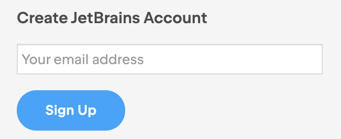
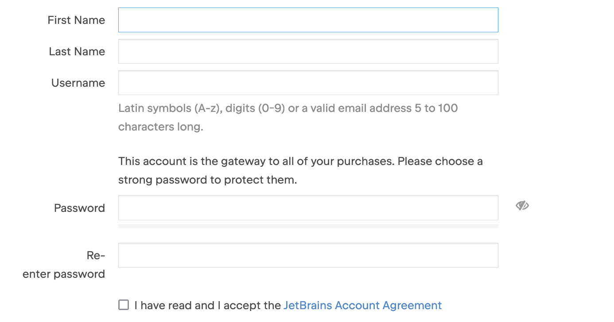
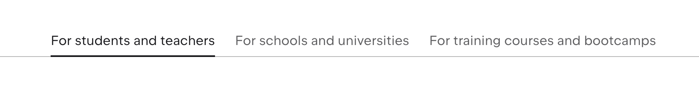
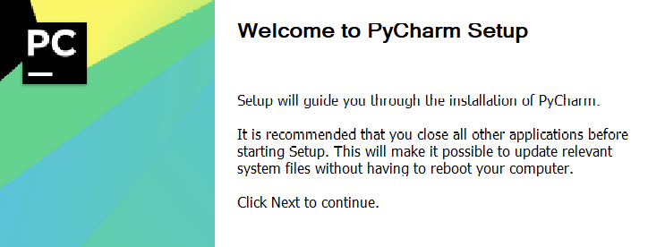

## Overview

This section will guide you through the process of creating a JetBrains account and applying for a free student or teacher license, which is necessary for accessing PyCharm.

## Steps for Creating a JetBrains Account and Applying for a License

1. **Open Browser and Go to JetBrains Student Page:**
     - Open your web browser and navigate to JetBrains Student page [https://www.jetbrains.com/student/](https://www.jetbrains.com/student/).

2. **Create Account:**
    - Click on the account icon located on the top right corner.
    - Enter your email and click "Sign Up".

    

3. **Confirm Email:**
    - Open your email inbox and find the email from JetBrains.
    - Open the email and click on the link to confirm your account.
    !!! Info
        The link should redirect you back to PyCharm's website for account setup.

4. **Enter Personal Information:**
    - Enter your personal information and set your password, then click "Submit".

    

5. **Apply for Free License:**
    - Click the account icon in the top right and click on "Apply for a free student or teacher license".
    - Select "Students and teachers" and scroll down to click "Apply Now".

    

6. **Fill Out Form:**
    - Fill out the "JetBrains Products for Learning" form using your BCIT student email.
    - Click "Apply For Free Product".

7. **Review and Submit:**
    - Review your information and click "Submit".

8. **Check Email for License Certificate:**
    - Open your email inbox and look for the License Certificate email from JetBrains.
    - Click the "link your free license" to finish student account setup.

9. **Download PyCharm:**
    - Login your PyCharm and open the account page.
    - Click the Download dropdown under "JetBrains Product Pack for Students" and select PyCharm and click download.

    
    !!! Info
        For the download client make sure to select MAC and the correct chip for your computer.
    - Follow the instructions in the email to download and install the JetBrains software using your license.

10. **Install PyCharm:**
    - Open the pycharmPY.exe that was downloaded and follow its Setup instructions.
    
    

## Conclusion

By the end of this section, you will have successfully learned the following:

:material-check: How to create a new JetBrains account

:material-check: How to apply for a free student or teacher license

Great job! 😊 You can now enjoy access to PyCharm for your learning and development projects. Go ahead and click on the link below to move on to the next step:

**[Connect PyCharm to GitHub](connectPycharmToGithub.md)**
